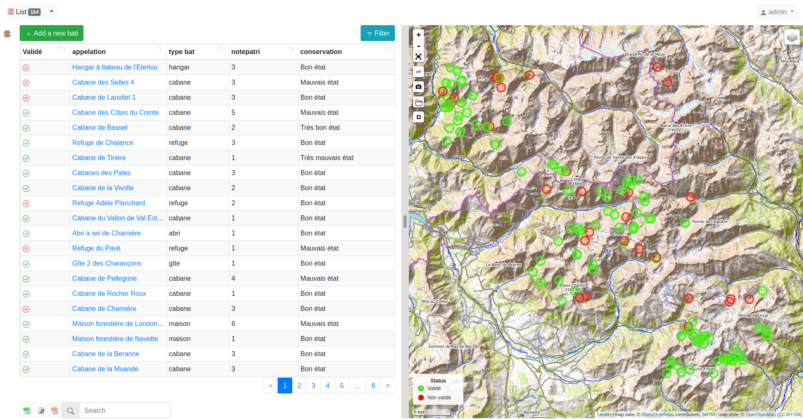
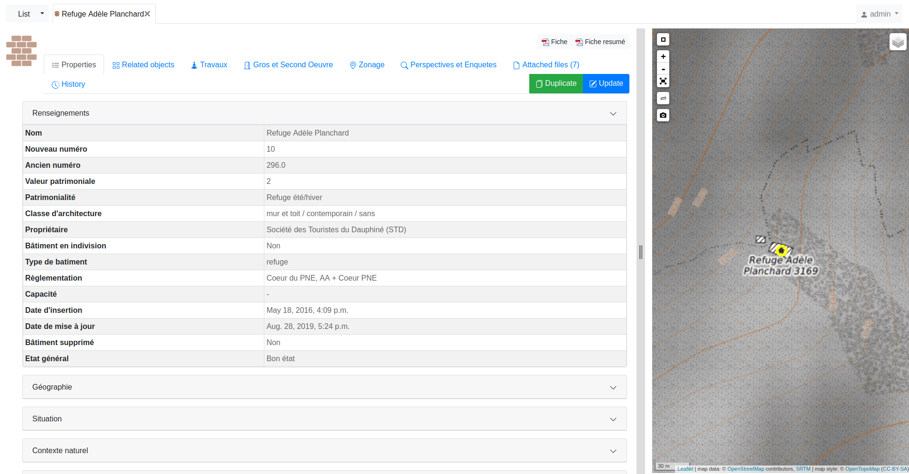
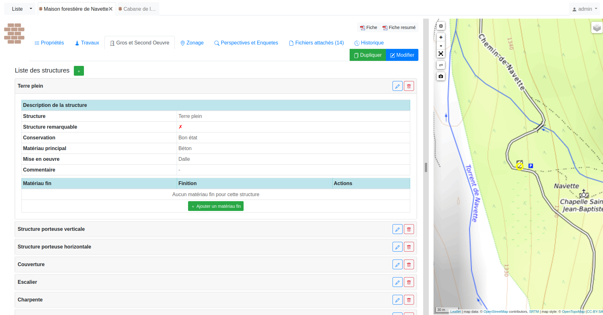

[](https://www.djangoproject.com/)
[](https://github.com/makinacorpus/django-mapentity)
[](https://www.postgresql.org/)
[](https://github.com/PnEcrins/Patrimoine-batu/commits/main)
[](https://github.com/PnEcrins/Patrimoine-bati/issues)

# Application Patrimoine bati

Version 2 de l'application Patrimoine bati développée en été 2025 par @glebiskava et @TheoLechemia.  
La version 1 a été développée en 2010 en PostgreSQL, PHP Symfony et ExtJS : https://github.com/PnEcrins/PatBati.

Cette version 2 est une refonte complète avec PostGIS, Python et Django (avec la librairie [Django-mapentity](https://github.com/makinacorpus/django-mapentity). L'ensemble de la base de données a été conservée mais sa structure a été simplifiée et optimisée, notamment en regroupant toutes les typologies dans une table centrale de nomenclatures.

Cette application web permet de réaliser un inventaire détaillé du patrimoine bâti d'un territoire : 

- Informations générales
- Environnement
- Travaux
- Gros oeuvre
- Second oeuvre
- Equipements
- Eléments paysagers
- Illustrations (photos et croquis)
- Documents
- Etat et perspectives

## Page d'accueil :

## Page détail :

## Example du Tab Gros et Second Oeuvre :


## Installation :

Avant d’installer l’application, il est nécessaire d’installer les bibliothèques nécéssaires avec le script suivant :

```bash
bash install_deps.sh
```

Créer la base de données PostgreSQL (vous pouvez choisir le nom que vous souhaitez, par exemple patbati) :

```SQL
CREATE DATABASE patbati;
```

Créer l'extension postgis dans la BDD :

```SQL
CREATE EXTENSION postgis;
```

Créer et activer un environnement virtuel Python :

```bash
python3 -m venv venv
source venv/bin/activate
```

Installer les dépendances Python du projet :

```bash
pip install -r requirements.txt
```

Configurer la base de données PostgreSQL (utilisateur, base, droits).

Configurer le fichier `settings_local.py` à partir de `settings_local.example.py` :

```bash
cp patbati/settings_local.example.py patbati/settings_local.py
```

Adaptez les paramètres (base de données, chemins, SSO, etc.) dans `settings_local.py`.

Effectuer les migrations de la base de données :

```bash
python manage.py migrate
```

Créer un superutilisateur Django :

```bash
python manage.py createsuperuser
```

Lancer le serveur de développement :

```bash
python manage.py runserver
```

Lancer la commande de création des permissions de mapentity

```bash
python manage.py update_permissions_mapentity
```

## Deploiement prod :

Installer gunicorn

```bash
pip install gunicorn
```

Configurer un service systemd pour gunicorn (voir documentation Django/gunicorn).

Regroupez tous les fichiers statiques à un seul endroit :
```bash
python manage.py collectstatic
```

Modifiez les paramètres dans `settings_local.py` :
```bash
ALLOWED_HOSTS = ["myhost"]
CSRF_TRUSTED_ORIGINS = ["http://myhost"]
```

*Créer un service systemd*

Copiez et adaptez le fichier d’exemple `patbati.service` dans `/etc/systemd/system/patbati.service`

**N'oubliez pas de créer le dossier de logs et de donner les droits à l'utilisateur utilisé par le service :**

```bash
sudo mkdir -p /var/log/patbati
sudo chown <USER>:<USER> /var/log/patbati
```

Activez et démarrez le service :

```bash
sudo systemctl daemon-reload
sudo systemctl enable patbati.service
sudo systemctl start patbati.service
```

Le service est maintenant démarré !


*Configurer Apache*

      apt install apache2
      a2enmod proxy
      a2enmod proxy_http

Créez une configuration dans `/etc/apache2/sites-available` :

      <VirtualHost *:80>
		#ServerName <SERVER_NAME>

		Alias "/static/" "/var/www/html/patbati/static/"
		<Directory "/var/www/html/patbati/static/">
			Require all granted
		</Directory>

		Alias "/media/" "/var/www/html/patbati/media/"
		<Directory "/var/www/html/patbati/media/">
		Require all granted
		</Directory>

		<Location "/">
			# RequestHeader necessaire pour le HTTPS
			# RequestHeader set X-Forwarded-Proto 'https' env=HTTPS
			ProxyPass http://127.0.0.1:8000/
			ProxyPassReverse http://127.0.0.1:8000/
			ProxyPreserveHost On
		</Location>

		<Location "/static">
			ProxyPass !
		</Location>

		<Location "/media">
			ProxyPass !
		</Location>
      </VirtualHost>


En HTTPS, il est 

#### Référentiel géographique : 

L'application doit être connectée à un référentiel géographique pour afficher et filtrer les zonages intersectés (communes, sites d'intérêt, etc.). L'application est fournie avec une app django (`zoning`) qui s'appuie sur deux tables `l_areas` et `bib_areas_type`. Django s'attend à les trouver dans le schéma `public`.  
Pour le déploiement en production au PNE, on a choisi de créer un schéma `ref_geo` en Foreign data wrapper (voir [docs/fdw.md](docs/fdw.md)) vers notre base de données existante du référentiel géographique, puis on créé des vues dans le schéma `public` pour les besoins de l'application : 

```sql
CREATE VIEW public.bib_areas_types AS 
SELECT * FROM ref_geo.bib_areas_types;

CREATE VIEW public.l_areas AS 
SELECT * FROM ref_geo.l_areas;
```

#### Mise à jour des permissions : 

Django-mapentity implémente des permissions supplémentaires aux permissions de Django. De plus, la permission "view" est appelée "read" dans mapentity.  
Lancer cette commande pour avoir toutes les permissions disponibles dans mapentity : 

```bash
python manage.py update_permissions_mapentity
```

## Développement : 

Installer les dépendances de tests : 

```bash
pip install -r requirements-dev.in
```

Lancer les tests : 

```bash
python manage.py tests
```

## Configuration : 

Configurer les paramètres de la base de données dans le fichier `settings_local.py`.

Possibilité d'utiliser le SSO avec OpenIDConnect et Authlib dans le fichier `settings_local.py` :

- Changer `SSO_LOGIN_ENABLED = True`
- Remplir la variable `SSO_DEFAULT_GROUP` avec le nom du groupe dans lesquels les nouveaux utilisateurs seront affecté automatiquement. Au préalable, il est nécessaire d'avoir créer ce groupe et de lui avoir donné les permissions voulues.
- remplir le dictionnaire `AUTHLIB_OAUTH_CLIENTS` avec vos informations de connexion
Dans le champs `SSO_ENDPOINT` il est necessaire de mettre l'URL d'accès au métadonnée du serveur d'authentification. Dans le cas de keycloak cela correspond à l'URL suivante : 
`https://<URL_KEYCLOAK>/realms/<NOM DU REALM>/.well-known/openid-configuration`